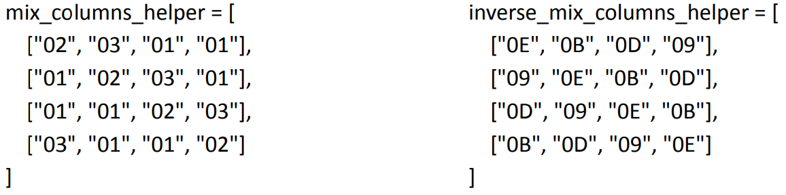

# AES 128-bit Program - Documentation
## Date: Saturday 12 April 2025

### Note:
A preview Video is found in the Files folder.

### Documentation:
First, I made the main function of the program, which is a main menu. The user will be asked for what he wants to do with the program: encrypt, decrypt, or exit the program. This main menu will keep looping until the user decides to exit.

The next thing I did was to implement a function (named get_message_and_key_in_hex) to get the message (plaintext/ciphertext), and the key. I did this function so that I don't repeat the same code twice in encryption and decryption. One function that can be used later whenever I need to.

On top of this function, I implemented a validation function (named validate_hex_128bits_input) to validate the values given in the previous function. The previous function will ask the user to enter the message, then send it to the validation function to check if the value is correct or not, if it is correct, the function will ask the user for the key and the same process goes. If the value is not correct, the user will be asked to enter the value again. The validation function uses regular expressions to check if the entered values for message and key are correct or not.

The next thing I did was implementing a function that transforms a piece of data (plaintext/ciphertext, and key) into a 4*4 matrix (named data_to_4_by_4_matrix). This function takes one attribute, which is the data to convert to a 4*4 matrix.

The challenge I faced during implementing this function was how to convert the hex data into a 4*4 matrix. Do I convert it to pure hex code (i.e. x02, x01, …) and split the values? Do I create a list variable of strings that contains the hex data? I had a lot of options. After analyzing, I thought that the best approach to take here, is to simply create a list of strings, where each string contains a byte (2 hex characters), then convert it into a 4*4 matrix.

To do this I made a new function (named data_to_bytes_list) that takes one attribute, which is the data string that needs to be converted into a byte list, then return the new list to the previous function to convert it into a 4*4 matrix.

Then I made a function (named print_4_by_4_matrix) to print any 4*4 matrix. It takes one attribute which is the matrix that we want to print.

The next thing I did was to start with the key expansion function. The key expansion function takes the key as an argument. I created a list that will hold all the words that will be generated. I divided the key into 4 words and put them inside that list. After that I created a function (generate_next_4_words) that takes a list of words and the round number as arguments. This function generates words based on these rules:  
K[n]:W[i] = K[n-1]:W[i] XOR K[n]:W[i-1]  
K[n]:W[0] = K[n-1]:W[0] XOR SubByte(K[n-1]:W3 >> 8) XOR Rcon[i]  

I made multiple helper functions to fully calculate the words while maintaining reusability. The functions I made were shift_bytes, this function takes a list of bytes and the number of shifts as arguments, it shifts that list based on that number. The second function I made was inverse_shift_bytes, I made this to use it later when we decrypt the ciphertext. It works the same way just backwards. The next function I made was xor_bytes, it takes 2 lists of bytes as arguments and xor them together byte by byte. And finally, I made the sub_bytes function, it takes 2 arguments, a list of bytes and the S-Box needed. This function is usable in encryption/decryption. For that reason I added the S-Box argument.

After creating the 4 words, they will be returned to the key_expansion function where they will get stored inside the words_list variable. After all the words are generated. I put them inside a dictionary of keys. Where each dictionary item is a key that holds 4 words combined from the words_list. After that I printed all the keys with their values, and returned the key dictionary to the main encryption/decryption function.

The next thing I did is to implement the Add Round Key function, this function takes 2 arguments, the state matrix (plaintext/ciphertext), and the key matrix. To xor the 2 matrices, I used my xor function. The problem was that my xor function xors lists of bytes, and not whole matrices. So to solve this problem, I looped through these matrices, the loop loops 4 times, and in each iteration, I call the xor function and give it the right row of the state and the key, then put the result in a matrix called result_matrix then return it.

The next thing I did is to implement the MixColumns and InverseMixColumns functions. This was the most challenging part to implement in this project as it contains a lot of steps which I broke down to smaller parts. I implemented the function as following:

First, I made a function called mix_columns that takes 2 arguments, the state to do MixColumn on, and a helper_matrix, the helper is the one that contains 01, 02, and 03 that will be multiplied with each bytes in the state. To do MixColumns for each cell: we take the column of that cell from the state and multiply it with the row of that cell from the heper_matrix. So for example if we want to calculate cell[2][3] (so the cell in the 3rd row, and 4th column), we will multiply column 3 of the state with row 2 of the helper_matrix. And the multiplication equation will look like this for example, (00 * 02) XOR (04 * 03) XOR (08 * 01) XOR (12 * 01). What I did is break this long equations into smaller parts eq1 = 00 * 02, eq2 = 04 * 03, eq3 = 08 * 01, and eq4 = 12 * 01. The final result will be eq1 XOR eq2 XOR eq3 XOR eq4. Now to calculate the smaller equations. I made another function called galois_field_multiplication, I named it that way because after researching, I found that it is Galois field multiplication. Where if we have 01, give the same value. 02, left shift and conditionally XOR with 0x1B. And finally 03: (value * 02) XOR value. Finally after all the calculations, return the new state.

Then I wanted to make the InverseMixColumns function. I struggled here a bit because I implemented it first in the way I thought it works: As I mentioned earlier how the multiplication works. Regarding the InverseMixColumns, I thought it is the opposite, I thought it multiplies the row of the state with the column of the helper_matrix (the same helper_matrix). But after testing my function, I didn't get the right results. So after researching a bit, I found that this way of InverseMixColumn is wrong, and the correct one is using the exact process of the normal MixColumn, just with a different helper_matrix. Here are the values of the normal helper_matrix, and the inverse one:

  

I'll provide a link to the source of the inverse_mix_columns_helper matrix with the references. So, when I found that the process of the InverseMixColumns is the exact same as the normal MixColumns, I deleted my incorrect inverse_mix_columns function, and used the mix_columns function I made for the encryption. But now when I call it, instead of passing the same helper matrix, I'll pass the inverse helper matrix for the decryption.

And finally, after building all these functions, I combined them all to make the main encryption and decryption functions.

References: https://crypto.stackexchange.com/questions/2569/how-does-one-implement-the-inverse-of-aes-mixcolumns